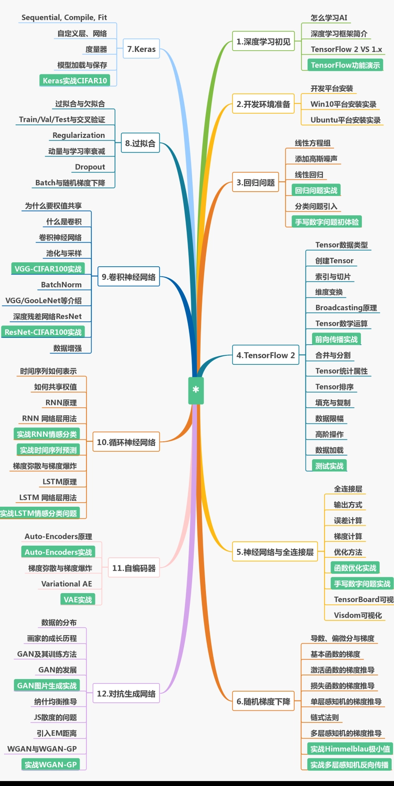

---

# 矩阵*向量
[理解矩阵乘法](http://www.ruanyifeng.com/blog/2015/09/matrix-multiplication.html)

# 微信积分求导

# 概率

# 了解CNN
[Medium](https://towardsdatascience.com/understanding-your-convolution-network-with-visualizations-a4883441533b)

(中文翻译)[深入理解CNN，可视化网络层](https://blog.csdn.net/qq_39575835/article/details/88106372)